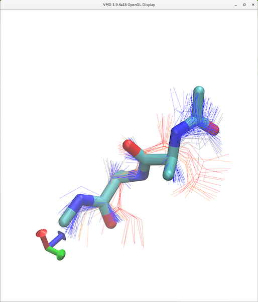

VMD Clustering Tool
=====

**VMD Clustering Tool** is a user-friendly clustering analysis plugin for Visual Molecular Dynamics (VMD). It allows user to analyze molecular dynamics (MD) trajectories or pdb structure files in an interactive way.

NEW Features:
* Represent cluster conformations with different representation options (default: Licorice)
* Selection of clusters and/or conformations to display on top of any existing presentations
* Easy switch between displaying all conformations or just the cluster centroid conformation

Features inherent from previous version:
* Compute clusters using VMD's internal [measure cluster](http://www.ks.uiuc.edu/Research/vmd/current/ug/node136.html) command
* Import results from *R*, *Xcluster*, *Gromacs*, *Charmm*, *NMRCLUSTER*
* Color conformations by cluster
* Multiple levels of clustering
* Custom representations
* Join single member clusters in a separate cluster



**Disclaimer**
This tool was mainly built on top of the previous version developed by Luis Gracia (https://github.com/luisico) at Weill Cornell Medical College, but with new features added by me to faciliate the use.

## Installation Guide

1. Download and install VMD following the user guide here: https://www.ks.uiuc.edu/Research/vmd/
2. Clone this project into your local path (e.g. */path/to/plugins/directory/clusteringtool*):
```sh
cd /path/to/plugins/directory
git clone https://github.com/alanklam/VMDplugins/clusteringtool.git clusteringtool
```

3. Add the following to *$HOME/.vmdrc* file, create the file if you don't have one yet:
```tcl
set auto_path [linsert $auto_path 0 {/path/to/plugins/directory}]
vmd_install_extension clusteringtool clustering "Analysis/Clustering\ Tool"
```
This should add the plugin to your VMD, under the *Extensions->Analysis* menu.

## Example Usage

An example use case (alanine dipeptide) is placed under the test/ folder.


1. Load a trajectory into VMD.
```tcl
mol new test/A2.psf
animate read dcd test/A2.dcd
```
2. Define the atom selection and molecule to analyze in in the plugin window, Mol:0, Selection: protein.
3. Calculate the clustering results with VMD's internal measure cluster command. More information about [measure cluster](http://www.ks.uiuc.edu/Research/vmd/current/ug/node136.html) can be found in VMD's manual. You are adviced to read the manual carefully to make sure you understand the meaning of each parameter. 
4. By default the plugin will show only the centroid conformations of each cluster, representations will be updated in the VMD window automatically.
  * The **Keep non-cluster representations** option allows user to keep all previously created representation of the molecule unchanged. Deselect the option will erase all representations other than the clusters representations.
  * Deselect **show centroid** to show all conformations in each cluster.
  * Activate **Join 1 member clusters** to display all single member clusters in a separate cluster (*outl*).
  * Select/Deselect **clusters**, **Confs**to show/hide a particular cluster or conformation.
  * **All** and **None** turn on/off all clusters and conformations. 
  * Whenever **Selection** or **Representations** is changed, click *Update Views* button to refresh the VMD window.

## About the inherent features
Please visit Dr. Luis Gracia's page for more info of the old features, including importing clustering results from R and Gromacs etc.
https://github.com/luisico/clustering

## Author
Kin Lam (https://github.com/alanklam)


## License
This plugin is redistributed under the terms specified in LICENSE.
